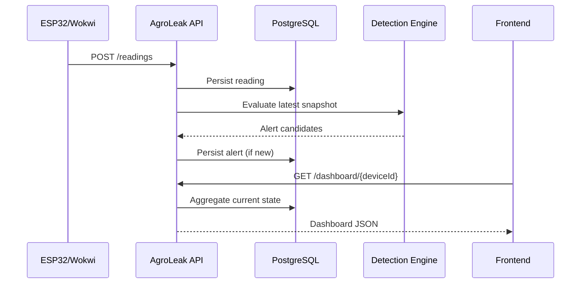

# Arquitectura v0.1

AgroLeak v0.1 usa un **modular monolith** para mantener bajo el costo de operación y desarrollo durante la fase académica, conservando límites claros de dominio.

## Bounded contexts / módulos

- `device`: identidad y estado de gateways.
- `telemetry`: adquisición/persistencia de mediciones.
- `monitoring`: evaluación de reglas.
- `alert`: ciclo de vida de anomalías detectadas.
- `valve`: comandos y confirmación del actuador.
- `pest`: contrato para observaciones de plagas.
- `dashboard`: read model agregado para el frontend.
- `demo`: escenarios controlados de exposición.

## Flujo principal

## Decisión: no microservicios todavía

La solución actual no justifica la complejidad de:

- service discovery;
- despliegues múltiples;
- observabilidad distribuida;
- consistencia eventual;
- colas obligatorias.

Los módulos ya están separados conceptualmente, por lo que se puede extraer uno cuando la carga o independencia operativa lo requiera.
