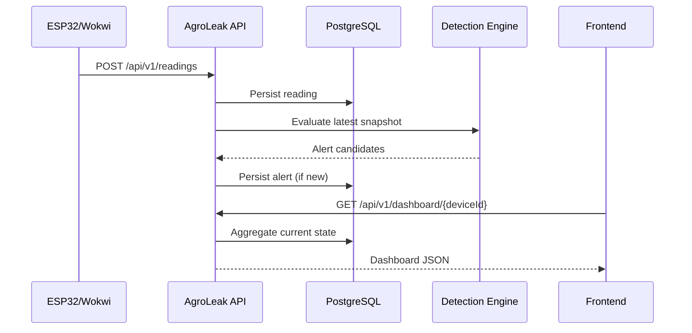

# Arquitectura v0.1

AgroLeak v0.1 usa un **modular monolith** para mantener bajo el costo de operación y desarrollo durante la fase académica, conservando límites claros de dominio.

## Bounded contexts y módulos compartidos

- `devices`: identidad y estado de gateways.
- `monitoring`: adquisición y persistencia de mediciones, consulta de lecturas y evaluación de reglas.
- `alerts`: ciclo de vida de anomalías detectadas.
- `irrigation`: comandos y confirmación del actuador.
- `pests`: contrato para observaciones de plagas.
- `analytics`: consultas agregadas para el dashboard del frontend.
- `common`: configuración transversal y manejo de excepciones.
- `demo`: carga de datos y escenarios controlados de demostración; no es un contexto de negocio.

La telemetría está integrada en `monitoring`; ya no existe un paquete independiente `telemetry`.

## Organización por capas

Se crean únicamente las capas que tienen clases existentes:

- `application`: servicios que coordinan casos de uso.
- `domain/model`: entidades, enums y modelos de dominio. Las entidades conservan sus anotaciones JPA y sus tablas actuales.
- `infrastructure`: repositorios Spring Data JPA y configuración técnica.
- `presentation/rest`: controllers REST.
- `presentation/rest/dto`: solicitudes y respuestas HTTP.

Los repositorios actuales extienden `JpaRepository`, por lo que permanecen en `infrastructure`. No hay contratos de repositorio independientes ni un paquete `domain/repository` vacío.

En `monitoring`, la estructura es:

```text
monitoring/
├── application/
│   ├── DetectionEngine.java
│   ├── DetectionService.java
│   └── ReadingService.java
├── domain/model/
│   ├── AlertCandidate.java
│   ├── SensorReading.java
│   ├── SensorSnapshot.java
│   └── SensorType.java
├── infrastructure/
│   ├── SensorReadingRepository.java
│   └── config/DetectionProperties.java
└── presentation/rest/
    ├── ReadingController.java
    └── dto/
        ├── CreateReadingRequest.java
        ├── LatestReadingsResponse.java
        └── ReadingResponse.java
```

## Dependencias actuales

`ReadingService` utiliza `DeviceService` para validar el dispositivo y actualizar su última actividad. Persiste la lectura y ejecuta `DetectionService`, que consulta las mediciones recientes, evalúa `DetectionEngine` y delega la creación de alertas a `AlertService`.

`analytics` agrega información de dispositivos, monitoreo, alertas, riego y plagas. `demo` utiliza los servicios existentes para generar sus datos y escenarios.

Este refactor conserva las dependencias existentes entre contextos, incluidas las referencias JPA a `Device`. También mantiene la construcción de `DashboardResponse` desde `DashboardService`; separar ese resultado de aplicación del DTO HTTP requeriría otro cambio. La reorganización no introduce eventos, adaptadores ni contratos nuevos.

## Compatibilidad REST

Los nombres de los paquetes no cambian las URLs: las lecturas siguen bajo `/api/v1/readings`, las válvulas bajo `/api/v1/valves` y el dashboard bajo `/api/v1/dashboard`. Se conservan los demás endpoints, los contratos JSON y la configuración de Swagger/OpenAPI.

## Flujo principal



## Decisión: no microservicios todavía

La solución actual no justifica la complejidad de:

- service discovery;
- despliegues múltiples;
- observabilidad distribuida;
- consistencia eventual;
- colas obligatorias.

Los módulos ya están separados conceptualmente, por lo que se puede extraer uno cuando la carga o independencia operativa lo requiera.
